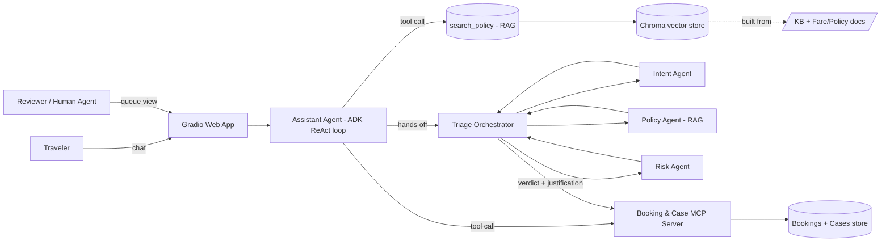
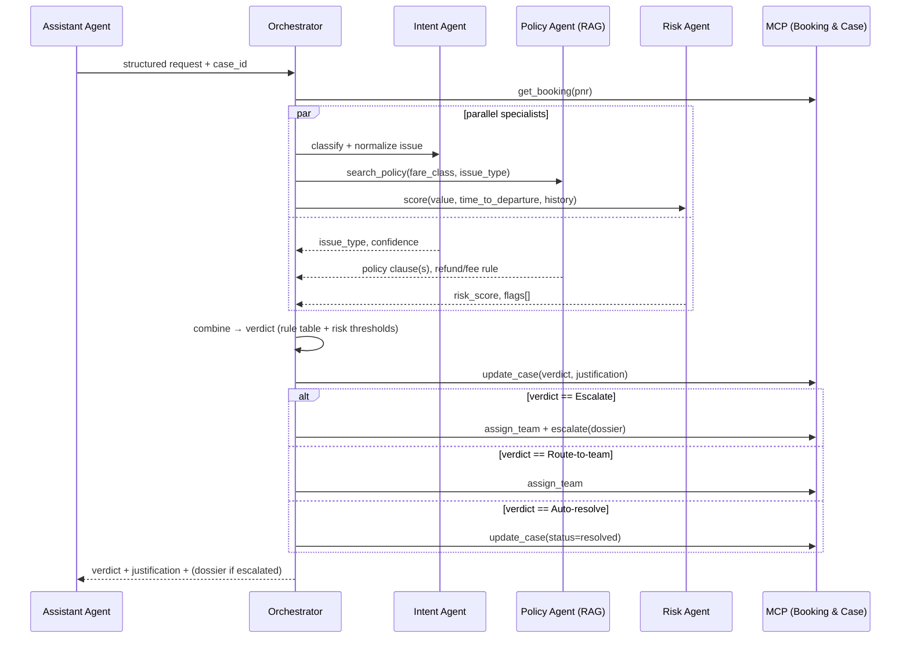

# ResolveAI — Architecture & System Design

Companion to [00_Problem_Statement_and_Spec.md](00_Problem_Statement_and_Spec.md). This document turns Sections 6–8 of the spec into a concrete, buildable design: components, data model, contracts, and sequence flows.

---

## 1. Design goals & non-negotiables

| Goal | Design consequence |
|---|---|
| Never fabricate a policy fact | Every price/fee/allowance claim must carry a retrieved-chunk citation; assistant refuses to answer ungrounded |
| One shared Booking & Case system | A single FastMCP server, two clients (Assistant Agent, Triage Orchestrator) — no duplicated booking/case logic |
| Multi-turn coherence | Session state (PNR, last-discussed leg/passenger, open case id) persisted per conversation, not per message |
| Explainable verdicts | Every triage decision carries a structured justification: policy clause id + signals used, not free prose alone |
| Deployable as one container | MCP server, RAG index, and agents all ship inside the same Cloud Run image (per spec §8 note) |

---

## 2. System context



---

## 3. Components

### 3.1 Traveler Chat UI + Reviewer Queue UI
See [03_UI_UX_Design.md](03_UI_UX_Design.md) for full detail. Both views are one Gradio app, two tabs, talking to the same backend session/case state — never a separate deployment.

### 3.2 Assistant Agent (ADK, ReAct loop)

**Role:** first point of contact. Answers what it can ground; hands off what it can't decide safely.

**Tools exposed to the LLM:**

| Tool | Args | Returns | Backing |
|---|---|---|---|
| `search_policy(query, fare_class=None, doc_type=None, k=4)` | free text + optional metadata filter | ranked chunks with `source_id`, `text`, `score` | Chroma retriever |
| `get_booking(pnr)` | PNR string | booking record (fare class, status, dates, baggage, delay_minutes, history fields) | MCP tool → `bookings.json` |
| `open_case(pnr, issue_type, summary)` | booking + free-text summary | `case_id` | MCP tool → case store |
| `get_status(case_id)` | case id | current case status/team/verdict | MCP tool → case store |

**Loop logic (ReAct, per turn):**
1. Read session state (PNR in focus, last leg/passenger, open case id, last 6 turns).
2. Extract intent + entities (few-shot prompt → structured JSON: `issue_type, pnr, passenger, flight_leg, fare_class, amount, urgency`).
3. If a **required** slot is missing (e.g., no PNR and none in session) → ask **one** targeted clarifying question, stop.
4. If intent is **answerable from KB/policy alone** (baggage limits, check-in window, fare inclusions, flight status) → call `search_policy` (+`get_booking` if fare-class-specific) → answer, citing `source_id`.
5. If intent requires a **decision** (refund, change-fee waiver, compensation, baggage claim, special assistance, suspected abuse) → do **not** decide itself. Call `open_case`, then invoke the **Triage Orchestrator** with the extracted structured request. Relay the orchestrator's verdict + justification back to the traveler in plain language, with the case id.
6. Update session state (new PNR/leg in focus, case id if opened).

**Guardrail hook points:** input validation before step 2; PII redaction before any logging; a hard cap of N tool calls per turn (default 4) and a wall-clock cap (default 12s) before forcing an "I'll open a case for a human to review" fallback.

### 3.3 Triage Orchestrator (Hierarchical / Multi-Agent)

**Role:** the only component allowed to produce a verdict. Runs as three specialist agents under a coordinator, **not a single prompt** (explicit spec requirement).



**Specialist responsibilities:**

- **Intent Agent** — normalizes free text into one of the fixed issue types (`refund`, `change`, `delay_compensation`, `baggage_claim`, `special_assistance`, `abuse_signal`) with a confidence score. Runs even if the Assistant Agent already extracted intent, as a second-opinion check (catches sarcastic/contradictory phrasing per spec's stress-test data).
- **Policy Agent (RAG)** — retrieves the exact fare-rule/policy clause(s) that govern this booking + issue (e.g., Saver → non-refundable; Flex → −₹1,500 up to 2h; delay 3h+ → refund/rebook/110% credit). Returns clause text + `source_id` for the justification trail — never a paraphrase without a citation.
- **Risk Agent** — computes a risk/value score from booking fields already in the dataset: `price_inr`, days-to-departure (`depart_datetime` − now), `account_age_days`, `prior_bookings`, `prior_refunds_90d`, `return_to_order_ratio`. High `prior_refunds_90d` + high `return_to_order_ratio` → abuse-signal flag.

**Verdict rule (deterministic core, LLM fills the gaps):**

| Condition | Verdict |
|---|---|
| Policy clause clearly grants the claim (e.g., delay ≥3h refund, Flex within window, airline-caused cancellation) AND risk_score low AND no abuse flag | **Auto-resolve** |
| Policy clause grants a fee/change/baggage action that a specialist team executes (rebooking, excess-baggage billing) | **Route-to-team** (Refunds / Rebooking / Baggage / Special Assistance) |
| Policy is ambiguous for this case, OR value is high (e.g., > ₹15,000), OR abuse flag set, OR special-assistance/medical/grievance, OR non-refundable dispute | **Escalate-to-human**, with auto-written dossier |

This table is the deterministic backbone; the Policy/Risk agents populate its inputs, and the LLM is used for the natural-language justification and for classifying genuinely ambiguous free text — the verdict itself is never "vibes," it's traceable to this table + a cited clause.

**Verdict output schema (JSON, stored on the case and shown in the reviewer UI):**

```json
{
  "case_id": "CASE-000123",
  "pnr": "SN8804",
  "issue_type": "delay_compensation",
  "verdict": "auto_resolve",
  "justification": {
    "policy_clause": "policy_delay_compensation.md#3-hours-or-more",
    "policy_text": "3 hours or more: full refund, free rebooking, or 110% travel credit",
    "signals": {
      "delay_minutes": 300,
      "fare_class": "Flex",
      "price_inr": 6400,
      "risk_score": 0.12,
      "abuse_flag": false
    },
    "reasoning": "Flight delayed 5h (>=3h threshold) — passenger entitled to refund/rebook/credit per delay-compensation policy. Low risk profile, no abuse signals."
  },
  "assigned_team": null,
  "dossier": null,
  "created_at": "2026-08-18T09:12:00Z"
}
```

### 3.4 Booking & Case System (MCP server, FastMCP)

One server, exposed over MCP, called by **both** the Assistant Agent and the Triage Orchestrator — the spec's "write once, reuse everywhere" requirement.

| MCP tool | Purpose | Reads/writes |
|---|---|---|
| `get_booking(pnr)` | fetch a booking record | reads `bookings.json` |
| `create_case(pnr, issue_type, summary, conversation_id)` | open a case | writes case store |
| `update_case(case_id, status=None, verdict=None, justification=None)` | progress a case | writes case store |
| `assign_team(case_id, team)` | route to Refunds / Rebooking / Baggage / Special Assistance | writes case store |
| `escalate(case_id, dossier)` | flag for human review | writes case store, appears in reviewer queue |
| `get_status(case_id)` | poll current state | reads case store |

Both clients (Assistant Agent, Orchestrator) hold their own MCP client connection to the same server process — in the Cloud Run deployment this is an in-process/stdio MCP transport inside one container (see [04_GCP_Deployment_Architecture.md](04_GCP_Deployment_Architecture.md)).

### 3.5 RAG pipeline

- **Ingestion:** LangChain `DirectoryLoader` over `data/kb/*.md` and `data/policies/*.md` → `MarkdownHeaderTextSplitter`/`RecursiveCharacterTextSplitter` (chunk size ≈500 tokens, overlap ≈50) → attach metadata per chunk: `{source_file, doc_type: kb|fare_rule|policy, fare_class: Saver|Flex|Business|None, topic}`.
- **Embedding:** `gemini-embedding-001`.
- **Store:** Chroma, two logical collections (`kb`, `policies`) or one collection with `doc_type` metadata filter — single collection with metadata filters is simpler to keep in sync and is the recommended default.
- **Retrieval:** top-k (default 4) similarity search, filtered by `fare_class` when the request has a known fare class (from `get_booking`), and by `doc_type` when the assistant already knows it needs a policy vs. a how-to article.
- **Grounding contract:** the LLM answer generator is instructed (system prompt + few-shot) to only state a fact if it appears in a retrieved chunk, and to attach `source_id`s inline; if retrieval returns nothing relevant (score below threshold), the assistant says so and offers to open a case rather than guessing.

### 3.6 Guardrails layer

| Guardrail | Mechanism |
|---|---|
| Input validation | reject/sanitize control characters, length caps, basic prompt-injection pattern checks on user free text before it's placed in any tool-call argument |
| PII redaction | regex + entity check on PNR (`SN\d{4}`), card-like digit sequences, email/phone before writing to logs or the dossier's non-essential fields |
| Step/cost cap | Assistant loop: max 4 tool calls / turn, 12s wall clock; Orchestrator: max 1 pass per specialist, 20s wall clock — both cap on timeout by escalating rather than hanging |
| Anti-hallucination | grounding contract above + a lightweight post-hoc check: any numeric claim (₹, kg, hours) in the assistant's reply must match a retrieved chunk's numbers, else the reply is rejected and regenerated once, then escalated |
| Human-in-the-loop | escalation is always available as a fallback from both the Assistant Agent (can't ground) and the Orchestrator (can't safely decide) — never a dead end |

---

## 4. Data model

### 4.1 Booking (existing, `data/bookings.json`)
`pnr · passenger · flight_no · origin · destination · international · depart_datetime · booked_datetime · fare_class · price_inr · status · delay_minutes · checked_baggage_kg · account_age_days · prior_bookings · prior_refunds_90d · return_to_order_ratio · scenario_note`

### 4.2 Case (new — needed for the MCP server, not yet in `data/`)

```json
{
  "case_id": "CASE-000123",
  "pnr": "SN8804",
  "conversation_id": "conv-abc",
  "issue_type": "delay_compensation",
  "status": "open | routed | escalated | resolved",
  "assigned_team": "Refunds | Rebooking | Baggage | Special Assistance | null",
  "verdict": "auto_resolve | route | escalate | null",
  "justification": { "...see 3.3 schema..." },
  "dossier": "string | null",
  "created_at": "ISO-8601",
  "updated_at": "ISO-8601"
}
```
Storage: local JSON/SQLite for dev; Firestore in production (see deployment doc) so state survives Cloud Run instance churn.

### 4.3 Session / conversation state (in-memory per session, ADK session service)
`conversation_id · pnr_in_focus · passenger_in_focus · last_leg · open_case_ids[] · turn_history[] (last N turns) · last_intent`

---

## 5. Sequence flows

### 5.1 Grounded Q&A (no decision needed)
Traveler asks a policy question → Assistant Agent extracts intent → `search_policy` (filtered by fare class if known) → answer with citation → session state updated. No MCP case action beyond an optional `get_booking` if fare class is needed.

### 5.2 Multi-turn coreference
Turn 1: "I'm on SN8804, can I change my flight?" → PNR captured in session. Turn 2: "What about my return leg?" → Assistant Agent resolves "return leg" against session's `pnr_in_focus`/booking record, no re-ask.

### 5.3 Clarify-on-ambiguity
"I have a problem with my trip" → no PNR in text or session, issue_type unclear → Assistant Agent asks one targeted question ("Could you share your PNR or booking reference?") → waits.

### 5.4 Triage → auto-resolve
Delay ≥3h claim on a Flex booking → `open_case` → Orchestrator run (3.3) → policy clearly grants relief, low risk → `auto_resolve`, `update_case(resolved)` → Assistant relays outcome + case id.

### 5.5 Triage → escalate
Non-refundable Saver dispute or high-value/abuse-flagged case → Orchestrator → `escalate(dossier)` → case appears in Reviewer Queue with full justification trail; human takes over via UI.

---

## 6. Non-functional requirements

- **Latency:** grounded Q&A < 4s p50; triage verdict < 10s p50 (parallel specialists).
- **Consistency:** case state is the single source of truth for both UI views — no client-side-only state for verdicts.
- **Auditability:** every verdict change is an append to the case's justification history, not an overwrite (supports the "justification faithfulness" eval metric).
- **Statelessness of compute:** the container itself holds no durable state (Cloud Run requirement) — all durable state in Firestore; the Chroma index is rebuilt from the bundled corpus at cold start (small corpus, sub-second).

## 7. Tech stack (from spec §8, restated with roles)

| Layer | Choice |
|---|---|
| LLM | Google Gemini (`gemini-3.1-flash-lite`) |
| Agent framework | Google ADK (Assistant Agent + Orchestrator specialists) |
| RAG | LangChain loaders/splitters + Chroma + `gemini-embedding-001` |
| Shared tools | FastMCP (Booking & Case server) |
| UI | Gradio (chat + reviewer queue, two tabs, one app) |
| Persistence (prod) | Firestore (cases, sessions), bundled JSON (bookings — static mock data) |
| Packaging/deploy | Docker → Google Cloud Run |

## 8. Key risks & mitigations

| Risk | Mitigation |
|---|---|
| Cloud Run cold start rebuilds Chroma index every scale-to-zero | Corpus is ~23 short docs — rebuild is sub-second; set `min-instances=1` if demo latency matters more than idle cost |
| Multi-instance Cloud Run breaks in-memory session/case state | Session state kept short-lived and reconstructable from Firestore case/turn history; case store is Firestore, not local files |
| LLM ignores grounding instructions under pressure | Post-hoc numeric-claim check (3.6) + eval metric #4 (grounding/hallucination rate) catches regressions before they ship |
| Orchestrator specialists disagree or one times out | Coordinator applies the deterministic rule table (3.3) with partial results and defaults to Escalate on missing/low-confidence input, never silently guesses |
