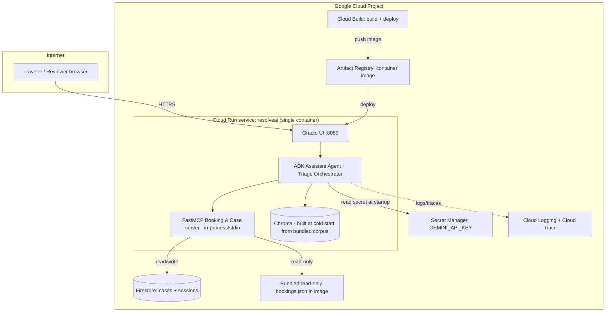

# ResolveAI — Google Cloud Deployment Architecture

Ships the system in [01_Architecture_and_Design.md](01_Architecture_and_Design.md) to Google Cloud per spec §8/§11 ("deploy to Google Cloud Run", "live Google Cloud URL"). Decisions below are the recommended default for a capstone-scale deployment — called out with rationale so they're easy to challenge.

---

## 1. Topology



**Core decision: one Cloud Run service, one container.** The spec explicitly calls this out ("On Cloud Run we control the container, so ... MCP ships with it") — the UI, both agents, and the MCP server run in the same process/container, with the MCP client-server link over stdio or localhost, not a separate network hop. This avoids standing up a second service, a second URL, and cross-service auth for a component (the MCP server) that only these two in-process clients ever call.

---

## 2. Persistence decisions

| Data | Where | Why |
|---|---|---|
| Bookings (`bookings.json`) | **Bundled in the container image**, read-only | It's static mock data (302 fixed PNRs) — no write path exists in the spec, so there's nothing Firestore buys here. Rebuilding the image on data changes is fine for this dataset's change frequency. |
| KB + policy corpus | Bundled in the image; Chroma index **rebuilt at container startup** | ~23 short markdown files — embedding + indexing takes well under a second. Rebuilding avoids the complexity of persisting a vector index across Cloud Run's ephemeral, horizontally-scaled instances (each instance would otherwise need its own copy or a shared network volume). |
| Cases (open/routed/escalated/resolved) | **Firestore (Native mode)** | This *is* mutable, concurrently-written state that must survive instance restarts and be consistent across multiple Cloud Run instances under load — the one place local/in-memory storage would silently lose data. Firestore is serverless, has a generous free tier, and needs no schema migration tooling for a document shape like the Case model in §4.2 of the architecture doc. |
| Session/conversation state | Firestore, same instance-safety reasoning; short TTL cleanup optional | Keeps "return leg too"-style coreference working even if a request lands on a different instance than the previous turn. |

**Alternative considered:** Cloud SQL (Postgres) for cases — rejected as unnecessary operational overhead (connection pooling, a schema migration story) for a document-shaped, low-write-volume case store at capstone scale. Revisit only if the case model grows relational joins (e.g., a separate `teams` or `agents` table).

---

## 3. Container build

- **Base image:** `python:3.11-slim`.
- **Multi-stage build:** stage 1 installs dependencies (`pip install -r requirements.txt`) and pre-builds the Chroma index from the bundled corpus (bakes ingestion into the image, so cold start only *loads* the index rather than re-embedding every restart — a cheaper refinement over "rebuild at every cold start" if embedding cost/latency matters); stage 2 copies the app + prebuilt index into a slim runtime layer.
- **Entrypoint:** starts the FastMCP server as a subprocess/in-process component, then the Gradio app on `$PORT` (Cloud Run injects `PORT`, default 8080).
- **What's in the image:** app code, `data/kb`, `data/policies`, `data/bookings.json`, prebuilt Chroma index. **Not** in the image: `GEMINI_API_KEY`, any Firestore credentials (pulled from the runtime environment/Secret Manager/ADC).

---

## 4. Identity & secrets

- **Service account:** a dedicated `resolveai-run-sa` (not the default compute SA), granted only:
  - `roles/secretmanager.secretAccessor` (for `GEMINI_API_KEY`)
  - `roles/datastore.user` (for Firestore case/session read-write)
- **Secret Manager:** `GEMINI_API_KEY` stored as a secret, mounted into the Cloud Run revision as an environment variable via `--set-secrets`, never baked into the image or committed to the repo.
- **No end-user auth in scope** (spec doesn't call for it) — the Cloud Run service is public HTTPS (`--allow-unauthenticated`). If this needs to be gated later, front it with Identity-Aware Proxy rather than building custom auth.

---

## 5. Scaling & cost controls

| Setting | Recommendation | Why |
|---|---|---|
| Min instances | `0` for pure demo/cost-minimization, `1` if cold-start latency (image load + Chroma load, ~2–5s) is unacceptable for reviewers/graders | Trade-off explicitly called out — no wrong answer, pick based on whether "instant first response" matters more than idle cost |
| Max instances | `3` | Capstone-scale traffic; caps runaway cost from e.g. a retry storm |
| CPU / memory | 2 vCPU / 2 GiB | Headroom for embedding calls + concurrent agent tool loops; right-size down after load-testing if usage is light |
| Concurrency | Default (80) is too high for an LLM-loop-per-request workload — set to **10–20** per instance | Each request holds several sequential Gemini calls; low concurrency avoids one instance choking on parallel agent loops |
| Request timeout | 60s | Covers worst-case triage path (parallel specialists + retries) with margin, per the 10s p50 target in the architecture doc's NFRs |
| Guardrail cost caps | Enforced in-app (max tool calls / wall clock, §3.6 of the architecture doc) | Cloud Run's own timeout is the last-resort backstop, not the primary cost control |

**Estimated cost at capstone/demo scale:** Cloud Run free tier (2M requests/month) and Firestore free tier (1 GiB storage, 50K reads + 20K writes/day) comfortably cover development, grading, and a live demo — expect this to run at effectively $0 unless traffic is sustained and high.

---

## 6. CI/CD

- **Manual path (sufficient for the capstone deadline):**
  ```bash
  gcloud builds submit --tag <region>-docker.pkg.dev/<project>/resolveai/app:latest
  gcloud run deploy resolveai \
    --image <region>-docker.pkg.dev/<project>/resolveai/app:latest \
    --service-account resolveai-run-sa \
    --set-secrets GEMINI_API_KEY=gemini-api-key:latest \
    --min-instances 0 --max-instances 3 \
    --cpu 2 --memory 2Gi --concurrency 15 --timeout 60 \
    --allow-unauthenticated
  ```
- **Stretch (Epic 9, marked optional in the backlog):** a Cloud Build trigger on push to `main` — `cloudbuild.yaml` runs build → push to Artifact Registry → `gcloud run deploy`. Worth adding only if iteration speed becomes a bottleneck; not required for the deliverables list.

---

## 7. Observability

- **Cloud Logging:** structured JSON logs from the app (each agent step, tool call, guardrail trip) — PII-redacted per the guardrails layer before it's ever logged.
- **Cloud Trace:** span per agent step (intent extraction → tool call → orchestrator specialist → verdict) so a slow request is diagnosable without re-running it.
- **Local debugging:** `adk web` for tracing the agent loop during development (per spec M8) — this is a dev-time tool, not part of the Cloud Run deployment itself.
- **Dashboard (optional):** a Cloud Monitoring dashboard on request latency, error rate, and Firestore read/write volume — nice-to-have, not a deliverable.

---

## 8. Environments

| Environment | How it runs | Persistence |
|---|---|---|
| Local dev | `docker compose up` or `adk web` + `python app/ui/main.py` directly | Local JSON/SQLite case store, local Chroma dir |
| Cloud Run (prod/demo) | Single service as above | Firestore |

Keep the case-store backend swappable behind one interface (`CaseStore`) with a local-JSON implementation and a Firestore implementation, selected by an env var — this is what makes "same code, two environments" actually true rather than aspirational.

---

## 9. Deployment runbook (step by step)

1. `gcloud auth login` / `gcloud config set project <project-id>`.
2. Enable APIs: `run.googleapis.com`, `artifactregistry.googleapis.com`, `secretmanager.googleapis.com`, `firestore.googleapis.com`, `cloudbuild.googleapis.com`.
3. Create Firestore database (Native mode, nearest region to the Cloud Run region).
4. Create the `resolveai-run-sa` service account and grant the two roles from §4.
5. Store `GEMINI_API_KEY` in Secret Manager; grant the service account access.
6. Create the Artifact Registry Docker repo.
7. Build and push the image (§6 manual path).
8. Deploy to Cloud Run with the flags in §6.
9. Smoke-test the live URL against 2–3 golden scenarios from `eval_scenarios.json` (one grounded Q&A, one triage/escalation) before calling it done.
10. Record the live URL in the README (spec deliverable).

---

## 10. Security checklist (maps to spec's guardrails requirement)

- [ ] No secret literal in image, repo, or Cloud Run YAML — Secret Manager only.
- [ ] Service account scoped to exactly two roles (§4), not `Editor`/`Owner`.
- [ ] PII redaction verified in Cloud Logging output before first real traffic.
- [ ] Cloud Run concurrency/timeout set to prevent one request's agent loop from starving others.
- [ ] Firestore security rules restrict access to the service account only (no public Firestore access).
