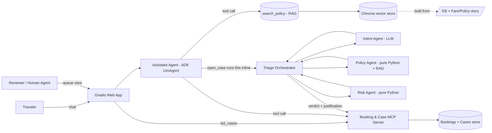
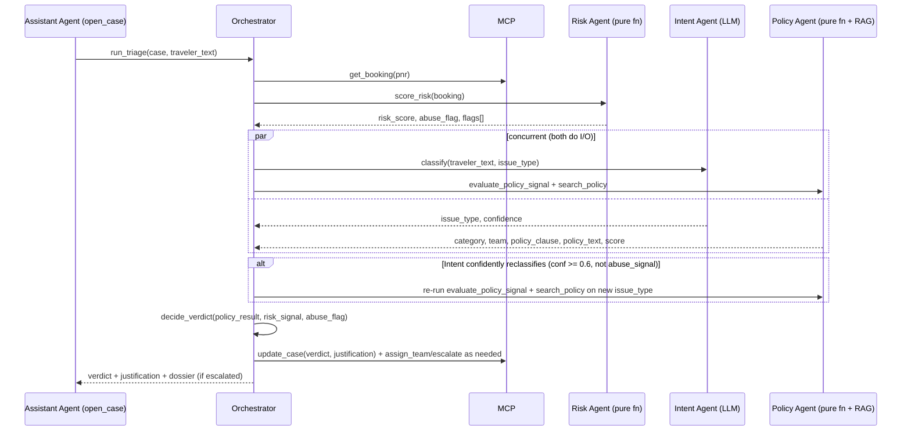

# ResolveAI — As-Built Architecture

This is the **as-built** record of the system actually shipped across Epics 0–10 — written by reading the real code (`app/`, `eval/`, `tests/`), not by updating the proposal. [`01_Architecture_and_Design.md`](01_Architecture_and_Design.md) is left untouched as the original pre-build design, for anyone who wants to compare intent against outcome. Use this doc to brief another team on what's actually running.

Sources: `app/agents/{tools,policy_agent,risk_agent,triage_orchestrator,session}.py`, `app/guardrails/caps.py`, `app/mcp_server/server.py`, `app/store/case_store.py`, and CLAUDE.md's per-epic Build status notes (cross-checked against the code, not taken on faith).

---

## 0. Summary of deviations from the original design

| Area | Original design (§ ref) | As-built | Why |
|---|---|---|---|
| Assistant Agent structure | Implied a multi-step extraction → response loop | One ADK `LlmAgent` with `output_schema` + `tools` together | `google-adk>=2.5` supports both at once; keeps the per-turn loop as one agent's reasoning instead of a chain |
| Policy Agent & Risk Agent | §3.3 describes them generically as "specialists" | Both are **pure, dependency-free Python** — no LLM call. Only the Intent Agent is a real model call | Keeps the verdict *category* "traceable to a rule table, never vibes" (non-negotiable); mock booking timestamps don't support real cutoff arithmetic, so eligibility rules key off booking fields + traveler phrasing instead; fully unit-testable offline |
| `open_case` tool contract | Opens a case; Orchestrator invoked as a separate step | Runs the Orchestrator **synchronously inside the same call** and returns the verdict | Avoids a second tool call the model would have to remember to invoke with re-supplied structured fields |
| Assistant wall-clock cap | §3.6: 12s default | **35s** (`app/guardrails/caps.py:43`) | 12s was *smaller* than the Orchestrator's own 20s cap invoked synchronously inside it — any decision-flow turn was guaranteed to trip the outer cap before the Orchestrator could finish, not a latency fluke. See [`failure_analysis.md` #1](failure_analysis.md#1-decision-flow-turns-tripped-the-assistants-wall-clock-cap-by-construction) |
| MCP tool count | §3.4: 6 tools | **7 tools** (+ `list_cases`) | The Reviewer Queue needed to list/filter cases; per "never a second implementation of booking/case logic," it became an MCP tool rather than the UI reading `data/cases.json` directly |
| Case schema | §4.2 | + `summary` (required — added Epic 3) · `justification.human_actions[]` (added Epic 7, additive) | `create_case`'s required `summary` arg had nowhere to live in the original schema; reviewer actions needed an audit trail *alongside* the AI's original justification, not overwriting it |
| Verdict rule table | §3.3: 3 generic rows (clause grants claim / team-executable / ambiguous or high-value) | Keyed on `issue_type` + booking `status`/`fare_class` + phrasing regexes (24h-recent-booking, medical/bereavement, weather), **then** an abuse-flag override, **then** a retrieval-confidence override | See §3.3 below for the real table — it's more granular than the original sketch, but still fully deterministic |
| Deployment build | §9: plain `gcloud builds submit --tag` | `cloudbuild.yaml` + BuildKit `--mount=type=secret` | The plain form has no way to inject a build secret; `GEMINI_API_KEY` must reach `python -m app.rag.build` without ever landing in an image layer |
| Cloud Build service account | Legacy `<project>@cloudbuild.gserviceaccount.com` | Default **compute** SA (`<project-number>-compute@developer.gserviceaccount.com`) | Current GCP default for new projects, not the legacy account the deployment doc assumed |
| Live URL | Documented working as of Epic 9 | **Currently returns HTTP 404** | Not redeployed/diagnosed this session (no access to the GCP project from this environment) — see Epic 10 note in CLAUDE.md |

---

## 1. Design goals & non-negotiables — status

All five hold, with the evidence that backs each one:

| Goal | Status |
|---|---|
| Never fabricate a policy fact | Enforced in code: `app/guardrails/hallucination_check.py` checks every numeric claim in a reply against the turn's retrieved chunks, regenerates once, then escalates on a second failure. Verified live in [`transcripts.md`](transcripts.md#transcript-1--grounded-answering-with-citation-e01). |
| One shared Booking & Case system | Still true, and stronger than originally scoped — the UI became a *third* MCP client (via `list_cases`) rather than reading `data/cases.json` directly. |
| Multi-turn coherence | `app/agents/session.py` session state (`pnr_in_focus`, `last_leg`, `open_case_ids`, `turn_history`) — covered by `tests/test_assistant_agent.py`'s coreference test. |
| Explainable verdicts | `justification.policy_clause` + `signals` always populated by `run_triage`, never null on a real verdict — see the CASE-000004 dossier in [`transcripts.md`](transcripts.md#transcript-3--escalation-with-its-full-dossier-case-000004). |
| Guardrails trip to escalation, never a dead end | True by construction (`session.py::_escalate_turn`, `triage_orchestrator.py::run_triage`'s `except asyncio.TimeoutError`) — but see [`failure_analysis.md` #2](failure_analysis.md#2-a-cap-trip-can-leave-two-cases-in-the-store-for-one-turn): a cap trip can occasionally leave *two* cases open for one turn, a real edge case in how this guardrail is wired, not a violation of the "never a dead end" guarantee itself. |

---

## 2. System context

Structurally unchanged from the original diagram — still one Gradio app, one Assistant Agent, one Orchestrator with three specialists, one MCP server, one Chroma store. The only structural addition is the UI as a third MCP client (via `list_cases`):



---

## 3. Components — as-built

### 3.1 Traveler Chat UI + Reviewer Queue UI
Matches the original design: one `gr.Blocks` app, two `gr.Tab`s, one process-wide `Backend`. A case opened in chat is visible in the Reviewer Queue on its next refresh, no restart. Built against `gradio==6.24.0` (repo's `requirements.txt` pins `>=5.0.0`; 6.x's messages-dict `Chatbot` format and `Dataframe`'s `row_count` API both needed adjusting for).

### 3.2 Assistant Agent (ADK)

One `LlmAgent`, not a ReAct chain of separate agents — `output_schema` and `tools` are used together in the same agent (tools during the thought loop, structure enforced on the final turn output). Four tools, matching the original design's names exactly:

| Tool | As-built signature | Notes |
|---|---|---|
| `search_policy(query, fare_class, doc_type)` | same as designed | |
| `get_booking(pnr)` | same as designed | |
| `open_case(pnr, issue_type, summary, traveler_message)` | **+`traveler_message`** | the verbatim traveler text, needed by the Orchestrator's specialists (sarcasm/abuse phrasing, dossier quote) — not just the model's paraphrased `summary` |
| `get_status(case_id)` | same as designed | |

**`open_case` is the real deviation:** it opens the case *and* runs the full Triage Orchestrator synchronously in the same call, returning `{case_id, verdict, assigned_team, policy_clause, policy_text, reasoning}`. The model is instructed to relay exactly what comes back, not decide anything itself — this keeps "the LLM never freelances the verdict category" true without a second tool call.

Guardrails: input validation + PII redaction before any logging (`session.py::send`), a 4-tool-call cap and a 35s wall-clock cap (raised from the original 12s — see §0), anti-hallucination check after every turn.

### 3.3 Triage Orchestrator — the real rule table

Per-turn sequence, from `triage_orchestrator.py::_run_triage_inner`:



Risk is a pure function (no I/O, so no need to run it concurrently); Intent and Policy both do I/O (an LLM call and a RAG search respectively) and run via `asyncio.gather`.

**`decide_verdict` — the actual deterministic core** (`triage_orchestrator.py:53`):

```
abuse_flag and policy category != "escalate"  -> escalate, team = policy team or "Refunds"
policy category == "auto"                     -> auto_resolve, no team
policy category == "route"                    -> route, team = policy team
else (policy category == "escalate")           -> escalate, team = policy team or "Refunds"
```

**`policy category` comes from `evaluate_policy_signal`** (`policy_agent.py:71`), a pure function keyed on `issue_type` + booking `status`/`fare_class` + phrasing regexes — not the original design's abstract "clause clearly grants / ambiguous / >₹15,000" test. In order of precedence per issue type:

- `special_assistance` → always `escalate` (medical clearance can't be auto-decided)
- `baggage_claim` → always `route` to Baggage
- `delay_compensation` → airline-caused cancellation or weather/force-majeure → `route` (Rebooking, no cash); ≥180min → `route` (Refunds, full refund/rebook/110% credit); ≥120min → `auto` (₹500 voucher only); else `auto` (nothing)
- `change` → airline-caused cancellation → `route` (Rebooking); else `route` (Rebooking, standard fee logic)
- `refund` / `abuse_signal` → airline-caused cancellation → `route`; no-show → `auto` (taxes only); "booked N hours/minutes ago" phrasing → `route` (24h free-cancel rule); Saver → `escalate` (non-refundable dispute, medical/bereavement phrasing adds a note but still escalates); Flex → `route` (minus ₹1,500 fee); Business → `route` (full refund); unknown fare → `escalate`
- anything else → `escalate` (no deterministic rule)

Then **two overrides**, both absent from the original sketch:
1. **Abuse override** (`risk_agent.py`): `return_to_order_ratio >= 0.5` alone sets `abuse_flag` (calibrated against the golden set — `prior_refunds_90d` alone isn't used, since at exactly 3 it collides with a real non-abuse scenario). Abuse forces `escalate` regardless of what the policy category said, unless the category was already `escalate`.
2. **Grounding-confidence override** (`policy_agent.py::run_policy_agent`): if `search_policy` returns nothing, or the top hit's score is below `RETRIEVAL_MIN_SCORE = 0.5`, the category is forced to `escalate` regardless of what the phrasing rules said — the verdict is never issued on a weak or missing citation.

### 3.4 Booking & Case System (MCP server)

7 tools, not 6 — `list_cases()` was added for the Reviewer Queue (no filter arg was actually needed; it returns the full case list and the UI filters client-side). Otherwise matches the original contract exactly: `get_booking`, `create_case`, `update_case`, `assign_team`, `escalate`, `get_status`.

### 3.5 RAG pipeline

Matches the design: single Chroma collection (`resolveai_policy`, cosine space) rather than two, `doc_type`/`fare_class` metadata filters. One addition: `search_policy` filters `fare_class` as "this fare OR fare-agnostic" (`$or`), not strict equality, so a Saver-specific question still surfaces general policy docs that don't declare a fare class.

### 3.6 Guardrails layer

Matches the design with the cap values corrected (§0) and one added behavior: on a cap trip or hallucination-check failure, the fallback always opens a **fresh** guardrail-escalation case rather than checking whether the turn's own `open_case` call already committed one — this is the root cause of the duplicate-case issue in [`failure_analysis.md` #2](failure_analysis.md#2-a-cap-trip-can-leave-two-cases-in-the-store-for-one-turn).

---

## 4. Data model — as-built

### 4.1 Booking
Unchanged from the design — static `data/bookings.json`, read-only.

### 4.2 Case
Original schema plus:
- `summary: string` — now **required** by `create_case` (had nowhere to live in the original example JSON).
- `justification.human_actions: [{action, note, actor, at}]` — appended, not overwritten, by every reviewer action (approve/deny/reassign/resolve). The AI's original `policy_clause`/`policy_text`/`signals`/`reasoning` stay intact alongside every human override, in the same dict.

### 4.3 Session / conversation state
Unchanged from the design: `conversation_id`, `pnr_in_focus`, `passenger_in_focus`, `last_leg`, `open_case_ids[]`, `turn_history[]` (capped at 6 entries), `last_intent`.

---

## 5. Sequence flows — as-built

5.1–5.5 (grounded Q&A, multi-turn coreference, clarify-on-ambiguity, auto-resolve, escalate) all match the original design's shape. One flow the original didn't anticipate:

### 5.6 Guardrail escalation (cap trip or hallucination-check failure)
Assistant loop exceeds 35s wall-clock, or the Orchestrator exceeds 20s, or a reply's numeric claim fails to verify twice → `session.py::_escalate_turn` / `triage_orchestrator.py`'s `except asyncio.TimeoutError` opens a **fresh** guardrail-escalation case (`policy_clause: "guardrail/human_review_required"`) and returns a plain "I've opened a case for a specialist to review" reply — never an error screen. See [`transcripts.md` #2](transcripts.md#transcript-2--a-guardrail-trip-that-escalates-instead-of-dead-ending-e05) for a real captured instance, and [`failure_analysis.md` #2](failure_analysis.md#2-a-cap-trip-can-leave-two-cases-in-the-store-for-one-turn) for the known duplicate-case edge case in this flow.

---

## 6. Non-functional requirements — verified status

| Requirement | Target | As-built evidence |
|---|---|---|
| Latency | grounded Q&A <4s p50, triage <10s p50 | Real smoke-test durations: E01 (grounded) 9.51s, E05 (decision, pre-cap-fix) 12.06s — both over target on the free-tier key's real network latency; not re-measured post-cap-fix or under load |
| Consistency | case state is single source of truth for both UI views | True by construction — both tabs read/write through the same `Backend`/MCP path, confirmed live (`refresh_table` picks up chat-tab-created cases with no restart) |
| Auditability | verdict changes are appended, not overwritten | True for human actions (`justification.human_actions`); the AI's own initial verdict write is still a single `update_case` overwrite, matching the original Case schema's one-`justification`-dict shape, not an append-only history |
| Statelessness of compute | container holds no durable state; Chroma rebuilt at cold start | True for Cloud Run: Chroma index is pre-baked into the image at build time (not rebuilt at cold start — an optimization beyond the original design, ~4s for 43 chunks), Firestore holds case/session state in prod |

Offline test suite: 105 passed / 10 skipped as of Epic 9 (`GEMINI_API_KEY`/`GOOGLE_API_KEY` unset — skipped tests are the live-key-gated ones). Full 62-scenario live eval run has not been executed (`eval/report.md` still reflects a 2-scenario smoke test) — see CLAUDE.md's Epic 10 note.

## 7. Tech stack — actual versions

Matches the original design's layer choices exactly (Gemini `gemini-3.1-flash-lite` + `gemini-embedding-001`, Google ADK, LangChain + Chroma, FastMCP, Gradio, Docker → Cloud Run, Firestore in prod). One pin worth knowing: `gradio==6.24.0` is what's actually installed and built against, ahead of the repo's `>=5.0.0` floor in `requirements.txt` — 6.x's breaking `Chatbot`/`Dataframe` API changes are what the UI code is written against, not 5.x.

## 8. Known issues / open risks

1. **Wall-clock cap sizing** — fixed (12s → 35s) but not re-verified live after the fix. See [`failure_analysis.md` #1](failure_analysis.md#1-decision-flow-turns-tripped-the-assistants-wall-clock-cap-by-construction).
2. **Duplicate-case race on a cap trip** — known, not fixed. See [`failure_analysis.md` #2](failure_analysis.md#2-a-cap-trip-can-leave-two-cases-in-the-store-for-one-turn).
3. **Golden eval set gap (E17)** — a data-authoring gap in `eval_scenarios.json`, not a code bug. See [`failure_analysis.md` #3](failure_analysis.md#3-the-injection-defense-scenarios-golden-routing-field-was-never-filled-in).
4. **Live Cloud Run URL is down** — returns HTTP 404 as of this session; not diagnosed or redeployed (no access to the GCP project from this environment).
5. **Full 62-scenario eval run has never been executed** — `eval/report.md`/`eval/results.json` reflect only a 2-scenario smoke test; all six spec §9 metrics exist and work, but haven't been run at full scale.
